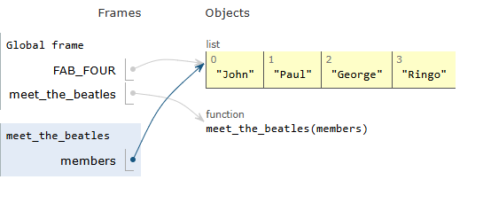

# Mutable Parameters
Recently one of our [PDM students](https://pybit.es/catalogue/the-pdm-program/) encountered some unexpected behaviour whilst trying to solve a [Python Bite](https://pybitesplatform.com).  

It turned out that this was a result of modifying a mutable parameter passed to a function - in this case a dict. 

Functions that mutate their input values or modify state in other parts of the program behind the scenes are said to have *side effects* and as a general rule this is best avoided.

## What is a Python Variable
When considering variables in Python it is a good idea to differentiate between a variable's name and the object that it represents.

```
>>> inspiration = None #1
>>> id(inspiration)
140713396607856
>>> inspiration = "Read Atomic Habits" #2
>>> id(inspiration)
3034242491760

>>> inspiration = "Bob and Julian" #3
>>> id(inspiration)
3034242497712

>>> nums = list(range(10))
>>> nums
[0, 1, 2, 3, 4, 5, 6, 7, 8, 9] #4
>>> id(nums)
3034242497984
>>> nums.append(10)
>>> nums
[0, 1, 2, 3, 4, 5, 6, 7, 8, 9, 10] #5
>>> id(nums)
3034242497984
```

1. The `inspiration` variable is pointing to the Singleton `None`
2. The `inspiration` variable is now pointing to a string
3. The `inspiration` variable is now pointing to a different string, and as strings are `immutable`, the `id` has changed. It's a different object.
4. The `nums` variable is pointing to a list
5. The list that `nums` is pointing to has been modified, but the `id` is the same because lists are `mutable`.

## Python passes parameters by Reference
Python passes parameters to functions by Reference - also referred to as *call by sharing*. This results in multiple names bound to the same object.  

Consider this simple case where a global variable is passed into a function:

```
FAB_FOUR = ["John", "Paul", "George", "Ringo"]


def meet_the_beetles(members) -> None:
    members.sort()
    print(f"   ...  {members}")


def main():
    print(f"Before: {FAB_FOUR}")
    meet_the_beetles(FAB_FOUR)
    print(f" After: {FAB_FOUR}")


if __name__ == "__main__":
    main()
```
Running the above code results in the following output:
```
python main.py
Before: ['John', 'Paul', 'George', 'Ringo']
   ...  ['George', 'John', 'Paul', 'Ringo']
 After: ['George', 'John', 'Paul', 'Ringo']
```

Which shows that our global variable FAB_FOUR has indeed been modified. This is because our function variable `members` is really just an alias for the global variable `FAB_FOUR` - they point to the same object. 

The excellent site [Python Tutor](https://pythontutor.com/) can be used to provide a nice visualisation:



## Take Care when programming with Mutable Parameters
Many programmers consider it bad practice for a function to modify a mutable parameter. But such behaviour is not uncommon in the real world.

At the very least, you should consider carefully whether the caller expects the argument to be changed.

If you want to protect your code from such *side effects*, consider using immutable types where possible/practical. 

If it is not clear to you whether it is safe to modify a passed mutable parameter - create a copy of the parameter and modify that instead. Comprehensions (list comprehension, dictionary comprehension, set comprehension etc) provide a nice pythonic way to create new objects as does the `copy` module with its `copy`, and `deepcopy` functions.
